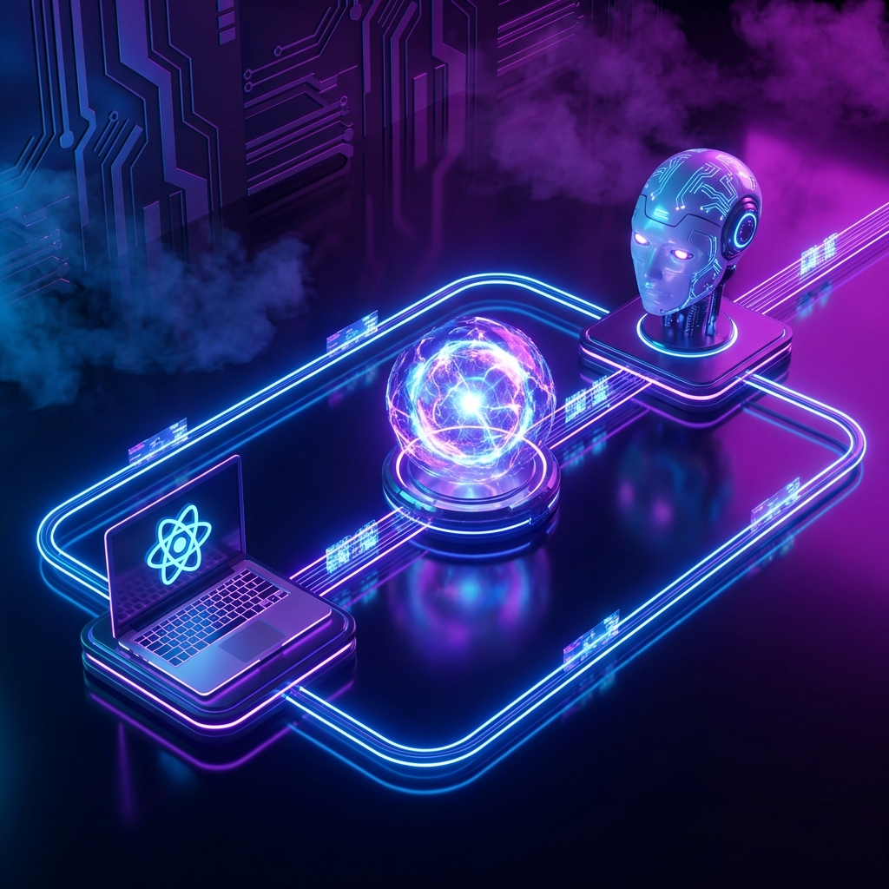

# Chat-MCP Bridge - Decoupled System


An ultra-modern, decoupled bridge system connecting **Model Context Protocol (MCP)** servers to a **React-based Chat Interface** via a standalone **Event Hub API**.

This project solves the tight-coupling issue between AI agents and their UIs, following an architecture similar to Discord bots: the MCP server acts as a stateless tool, while the UI lives behind a persistent WebSocket/SSE bridge.

## 🏗️ Architecture



The system is split into three independent layers:

1.  **Frontend (React + Vite)**: A premium glassmorphism chat interface.
2.  **Event Hub (Express API)**: A persistence layer that manages connections and broadcasts messages via **Server-Sent Events (SSE)**.
3.  **MCP Server (Stdio)**: A stateless client that sends messages to the hub using standard HTTP POST requests.

## ✨ Features

- **Decoupled Design**: Restart your UI without crashing your AI tools.
- **Real-time Streaming**: SSE-based message delivery with ultra-low latency.
- **Stdio First**: Compatible with all standard MCP environments (Claude Desktop, etc.).
- **Vite Proxy**: Zero CORS configuration needed during development.
- **Glassmorphism UI**: Beautiful, modern aesthetic with Tailwind CSS and Lucide icons.

## 🚀 Quick Start

### 1. Prerequisites

- Node.js (v18+)
- pnpm / npm / yarn

### 2. Installation

```bash
# Clone the repository
git clone https://github.com/Nexus-AI/Chat-MCP-Bridge.git
cd Chat-MCP-Bridge

# Install dependencies for both Hub and Server
pnpm install
cd server && pnpm install
cd ..
```

### 3. Running the Project

```bash
# Start both Frontend & Hub API
pnpm dev
```

The application will be available at:

- Frontend: `http://localhost:5173`
- Hub API: `http://localhost:3002`

### 4. Configuring MCP Server

Add the following to your `mcp_config.json`:

```json
{
  "mcpServers": {
    "chat-bridge-mcp": {
      "command": "node",
      "args": ["${PROJECT_ROOT}/chat_mcp/server/dist/index.js"]
    }
  }
}
```

## 🛠️ Tools Included

- `send_chat_message`: Dispatches a message to the UI hub.
- `get_frontend_status`: Checks if any frontend clients are live.

## 📄 License

MIT
