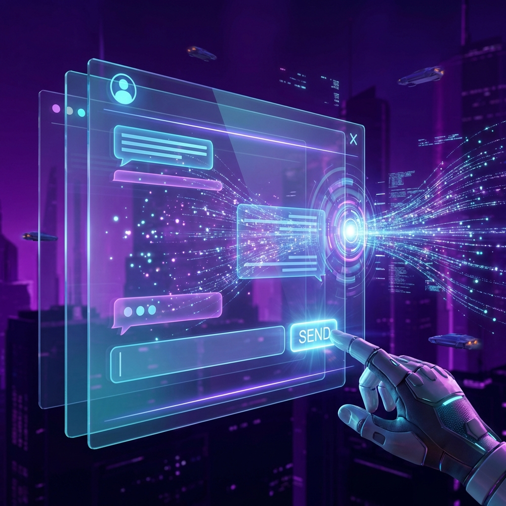
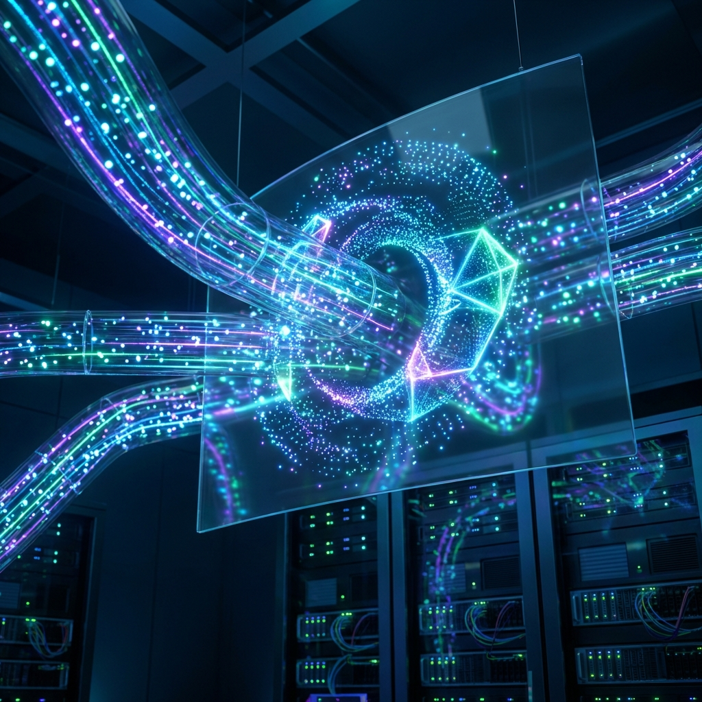

// turbo-all

# 🌌 Chat-MCP Bridge Workflow

This workflow automates the loop of receiving human input from the Chat Interface, processing it via an AI Agent, and broadcasting the response back to the bridge.

## 🏁 Steps

### 1. User Sends Input via UI



When you type a message in the Chat interface and click **Send**, the UI automatically sends a POST request to the Bridge Hub (`/api/messages`) with `role: "user"`.

### 2. Bridge Triggers AI Agent (Claude Code Runner)

// turbo
The Hub (or a monitoring script) detects the new user message and invokes the **Claude Code Runner** agent. The agent then reads the message and prepares a response.

```bash
# Example of how the bot is called with the user input
mcp-run chat-bridge-mcp "Reply to this customer: [LATEST_USER_MESSAGE]"
```

### 3. Verify Message Delivery & Live Stream



// turbo
Check the bridge server logs to ensure the agent successfully called the `send_chat_message` tool. The response is then streamed back to the UI interface in real-time.

```bash
# Verify log entry for broadcast
tail -n 5 server/mcp.log
```

## 🛠️ Automated Execution Guide

To run this workflow continuously in the background, you can use the orchestrator:

```bash
pnpm workflow
```

---

_Generated for DeamonDev888 / Chat-MCP-Bridge_
